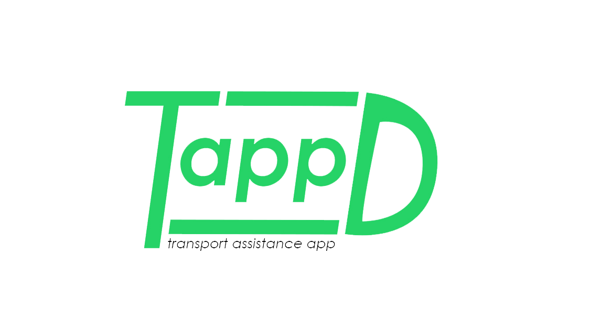

<p align="center">

 <h2 align="center">Tappd Backend</h2>
 <p align="center">Backend Server in NestJS for Tappd.</p>
</p>

## Quick Start

1. Set up config variables

   a. Duplicate the file `config/sample.env` and rename it to `config/config.env`.

   b. Fill in all credentials required in the new file, as follows:
   | Variable | Value |
   | --------- | -------------------------------------------- |
   | NODE_ENV | development / production |
   | PORT | 5100 |
   | MONGO_URI | Copy your MongoDB **Connection String** here.<br/> **(Skip if setting up with [VSCode Dev Container](#develop-in-vscode-dev-container))** |

2. See [App Setup](#app-setup) to setup the app.

## App Setup

Setup app with either method:

1. [Develop in VSCode Dev Container](#develop-in-vscode-dev-container) (RECOMMENDED)
2. [Manual installation](#manual-installation)

### Develop in VSCode Dev Container

#### Pre-requisite

- [VSCode](https://code.visualstudio.com/)
- [Docker Engine v19.03.0+](https://docs.docker.com/engine/install/)
- [Docker Compose v1.29.1+](https://docs.docker.com/compose/install/)
- [VSCode Extension Remote - Containers](https://marketplace.visualstudio.com/items?itemName=ms-vscode-remote.remote-containers)

#### Steps

1. Open repo in VSCode.
2. VSCode will prompt to open the workspace in the remote container. `Folder contains a dev container configuration file. Reopen folder to develop in a container`
3. Select `Reopen in container`, VSCode will setup a fully ready environment.
4. Refer to the bottom left-hand corner of VSCode to verify that container is setup. It should have a text stating `Dev Container: Tappd Backend Development`
5. To run app, see [Running the app](#running-the-app)

### Manual installation

#### Pre-requisite

App requires the following dependencies to be installed locally (in the following order):

- [NodeJS v16 (via nvm)](https://github.com/nvm-sh/nvm) To verify: `nvm -v`
- [NestJS 7 (Optional)](https://docs.nestjs.com) To verify: `nest -v`

> **NB**: NestJS installation is required for development. It is not required to run the app.

#### Steps

1. Run `nvm install && nvm use`
2. Verify node version with `node -v`
3. Run `npm install`
4. To run app, see [Running the app](#running-the-app)

## Running the app

```bash
# development watch mode
$ npm run start:dev

# production mode
$ npm run start:prod
```

## Test

```bash
# unit tests
$ npm run test

# test coverage
$ npm run test:cov
```

### API Documentation + Test Endpoints

[Swagger API](https://tappd-be.herokuapp.com/api)
